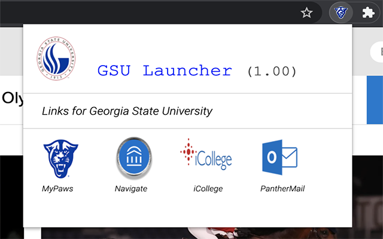

# GSU-Launcher

GSU-Launcher is a chrome web extension that allows GSU students to efficiently visit the University's most commonly used websites.

</img>

## Installation

1. Download this repository
2. Visit <a href = "chrome://extensions" target = "_blank" >chrome://extensions</a>
3. Click on "Load unpacked" and select the folder you just downloaded
4. Make sure it is enabled, and enjoy!

## Contributing
Pull requests are welcome. For major changes, please open an issue first to discuss what you would like to change.

Please make sure to update tests as appropriate.

## License
[MIT](https://choosealicense.com/licenses/mit/)